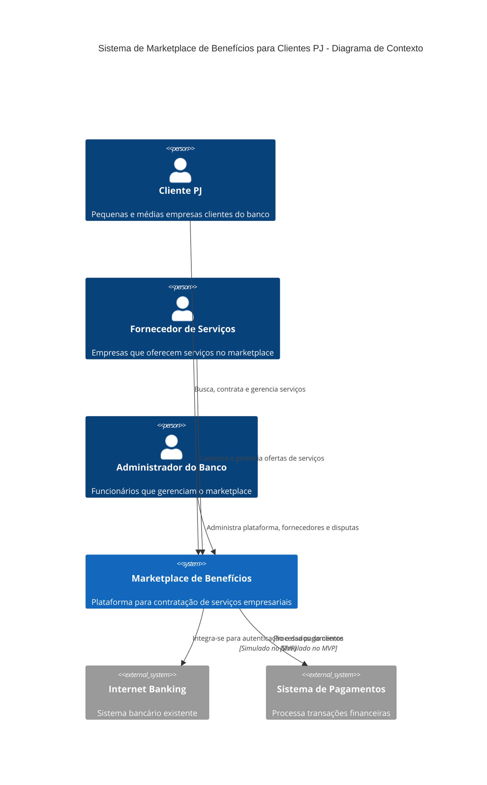
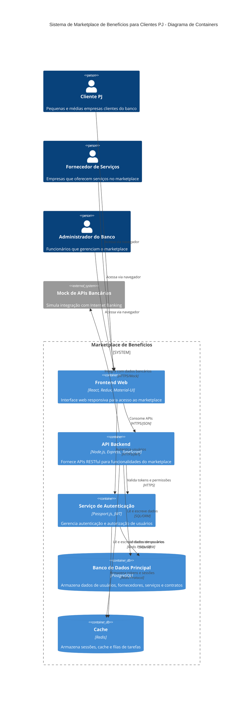
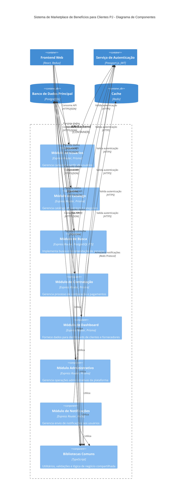
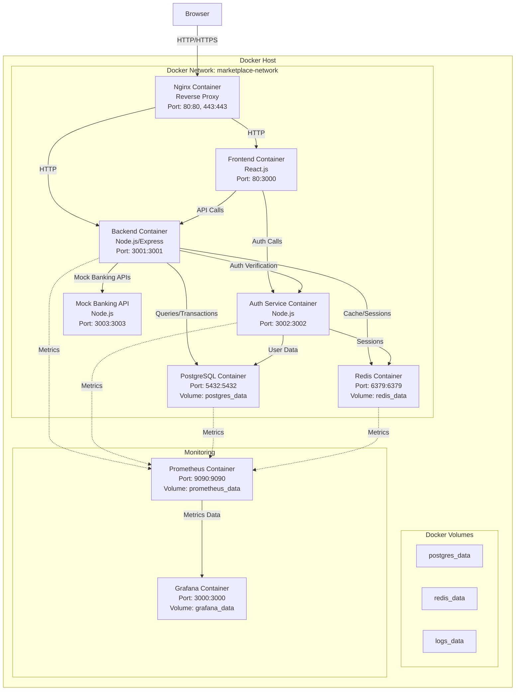

# Arquitetura do Sistema: Marketplace de Benefícios para Clientes PJ

## Informações do Documento
- **Projeto**: Marketplace de Benefícios para Clientes PJ
- **Data**: 2025-05-27
- **Versão**: 1.0
- **Autor**: Solution Architect

## Sumário
1. [Visão Geral da Arquitetura](#1-visão-geral-da-arquitetura)
2. [Stack Tecnológica](#2-stack-tecnológica)
3. [Diagramas da Solução](#3-diagramas-da-solução)
4. [Descrição dos Componentes](#4-descrição-dos-componentes)
5. [Padrões e Boas Práticas](#5-padrões-e-boas-práticas)
6. [Considerações sobre Infraestrutura e Deploy](#6-considerações-sobre-infraestrutura-e-deploy)
7. [Limitações e Premissas](#7-limitações-e-premissas)

## 1. Visão Geral da Arquitetura

### 1.1 Modelo Arquitetural

Para o desenvolvimento do Marketplace de Benefícios para Clientes PJ, propomos uma **arquitetura monolítica modular** organizada em camadas bem definidas. Esta abordagem foi escolhida pelos seguintes motivos:

1. **Simplicidade para o MVP**: Facilita o desenvolvimento rápido e reduz a complexidade operacional
2. **Modularidade**: Permite isolar funcionalidades em módulos bem definidos, facilitando manutenção
3. **Caminho para evolução**: Possibilita uma migração futura para microsserviços, se necessário
4. **Menor overhead operacional**: Reduz a complexidade de deploy, monitoramento e debugging

A arquitetura será baseada em um modelo MVC (Model-View-Controller) estendido, com separação clara de responsabilidades entre as camadas de:
- Apresentação (Frontend)
- Aplicação (Backend APIs)
- Domínio (Regras de Negócio)
- Infraestrutura (Persistência e Serviços Externos)

### 1.2 Princípios Arquiteturais Adotados

1. **Separação de Responsabilidades**: Cada componente possui funções bem definidas
2. **DRY (Don't Repeat Yourself)**: Evitar duplicação de código e funcionalidades
3. **SOLID**: Princípios de design orientado a objetos para manutenibilidade
4. **API-First**: Todas as funcionalidades expostas via APIs bem documentadas
5. **Security by Design**: Segurança incorporada desde o início do projeto
6. **Testabilidade**: Arquitetura que facilita testes unitários e de integração

### 1.3 Integração com o Ambiente Bancário

Embora o MVP não dependa diretamente do Internet Banking para funcionar, a arquitetura prevê pontos de integração para quando este estiver disponível:

1. **SSO (Single Sign-On)**: Integração com o sistema de autenticação do banco
   - Para o MVP: Implementação de autenticação independente
   - Para produção: Integração via OAuth2/OIDC com o Identity Provider do banco
   
2. **API Gateway**: Ponto de entrada único para comunicação entre o Marketplace e os sistemas bancários
   - Para o MVP: Simulação de APIs bancárias para demonstração
   - Para produção: Integração real com APIs do banco

3. **Transações Financeiras**: Integração com sistema de pagamentos
   - Para o MVP: Fluxo simulado de pagamentos
   - Para produção: Integração com APIs de pagamento do banco

## 2. Stack Tecnológica

### 2.1 Frontend

| Componente | Tecnologia | Justificativa |
|------------|------------|---------------|
| Framework | **React.js** | Biblioteca madura, grande comunidade, facilidade de encontrar desenvolvedores |
| Gerenciamento de Estado | **Redux** | Padrão estabelecido para gerenciar estado em aplicações React complexas |
| UI Components | **Material-UI** | Kit de componentes completo que segue as diretrizes de Material Design |
| Build Tool | **Vite** | Ferramenta moderna e rápida para desenvolvimento e build |
| Testes | **Jest + React Testing Library** | Ferramentas padrão para testes em React |

### 2.2 Backend

| Componente | Tecnologia | Justificativa |
|------------|------------|---------------|
| Linguagem | **Node.js com TypeScript** | Tipagem forte, mesma linguagem do frontend, grande ecossistema |
| Framework Web | **Express.js** | Framework leve, maduro e flexível para APIs RESTful |
| ORM | **Prisma** | ORM moderno com excelente suporte a TypeScript e migrações |
| Validação | **Zod** | Biblioteca de validação de esquemas compatível com TypeScript |
| Autenticação | **Passport.js + JWT** | Solução flexível para autenticação com suporte a múltiplas estratégias |
| Documentação API | **Swagger/OpenAPI** | Padrão da indústria para documentação de APIs |
| Testes | **Jest + Supertest** | Combinação poderosa para testes unitários e de integração |

### 2.3 Banco de Dados

| Componente | Tecnologia | Justificativa |
|------------|------------|---------------|
| Principal | **PostgreSQL** | Banco relacional maduro, open-source, com suporte a JSON |
| Cache | **Redis** | Alta performance para caching, sessões e filas de tarefas |
| Busca | **Elasticsearch** (opcional para MVP) | Para recursos avançados de busca e recomendação |

### 2.4 DevOps e Infraestrutura

| Componente | Tecnologia | Justificativa |
|------------|------------|---------------|
| Containerização | **Docker + Docker Compose** | Facilita a configuração do ambiente de desenvolvimento e deployment |
| CI/CD | **GitHub Actions** | Integração simples com GitHub, workflows flexíveis |
| Monitoramento | **Prometheus + Grafana** | Solução open-source completa para métricas e visualização |
| Logs | **ELK Stack (Elasticsearch, Logstash, Kibana)** | Centralização e análise de logs (simplificado para o MVP) |

## 3. Diagramas da Solução

### 3.1 Diagrama C4 - Contexto

### 3.2 Diagrama C4 - Container

### 3.3 Diagrama de Componentes

### 3.4 Diagrama de Implantação

## 4. Descrição dos Componentes

### 4.1 Frontend Web (React.js)

O frontend da aplicação será desenvolvido em React.js e será responsável por fornecer interfaces distintas para os três tipos de usuários do sistema: Clientes PJ, Fornecedores e Administradores.

**Funcionalidades Principais:**
- Interface responsiva adaptada para desktop e dispositivos móveis
- Rotas protegidas baseadas em perfil de usuário
- Gerenciamento de estado centralizado com Redux
- Componentes reutilizáveis seguindo design system consistente
- Comunicação com backend via APIs RESTful

**Módulos Principais:**
1. **Auth Module**: Autenticação e gerenciamento de sessão
2. **Marketplace Module**: Busca, visualização e contratação de serviços
3. **Supplier Module**: Gestão de serviços para fornecedores
4. **Admin Module**: Ferramentas administrativas
5. **Dashboard Module**: Painéis personalizados para cada tipo de usuário
6. **Profile Module**: Gerenciamento de perfis e preferências

### 4.2 API Backend (Node.js/Express)

Servidor de APIs RESTful desenvolvido em Node.js com TypeScript, responsável por implementar a lógica de negócio, processamento de dados e comunicação com o banco de dados.

**Funcionalidades Principais:**
- Endpoints RESTful documentados via Swagger/OpenAPI
- Validação de entrada com Zod
- Mapeamento objeto-relacional com Prisma
- Logging estruturado para auditoria e monitoramento
- Tratamento centralizado de erros
- Middleware de autenticação e autorização

**Módulos Principais:**
1. **Módulo de Usuários**: Gerencia cadastro, perfis e preferências
2. **Módulo de Catálogo**: Gerencia categorias, serviços e precificação
3. **Módulo de Busca**: Implementa busca e recomendação personalizada
4. **Módulo de Contratação**: Gerencia processo de contratação e pagamentos
5. **Módulo de Dashboard**: Fornece métricas e dados para painéis
6. **Módulo Administrativo**: Ferramentas de gestão da plataforma
7. **Módulo de Notificações**: Sistema de notificações para usuários

### 4.3 Serviço de Autenticação (Passport.js/JWT)

Serviço dedicado à autenticação e autorização de usuários, implementando:

**Funcionalidades Principais:**
- Autenticação via email/senha para o MVP
- Preparação para SSO com Internet Banking
- Geração e validação de tokens JWT
- Gerenciamento de sessões com Redis
- Controle de acesso baseado em perfis (RBAC)
- Auditoria de tentativas de login e ações sensíveis

### 4.4 Banco de Dados Principal (PostgreSQL)

Banco de dados relacional para armazenamento persistente de dados:

**Principais Entidades:**
- Usuários (clientes, fornecedores, administradores)
- Categorias e Serviços
- Contratos e Transações
- Avaliações e Feedback
- Logs de Auditoria

**Características:**
- Esquema relacional com chaves estrangeiras e restrições
- Índices otimizados para consultas frequentes
- Recursos de busca textual (PostgreSQL Full Text Search)
- Armazenamento de dados JSON para estruturas flexíveis

### 4.5 Sistema de Cache (Redis)

Banco de dados em memória para dados temporários e de acesso frequente:

**Usos Principais:**
- Armazenamento de sessões de usuário
- Cache de dados frequentemente acessados
- Filas de tarefas assíncronas (notificações, emails)
- Rate limiting e proteção contra abusos
- Dados de estado temporário

### 4.6 Mock de APIs Bancárias

Serviço que simula as APIs do banco para o MVP:

**Funcionalidades Simuladas:**
- Autenticação de clientes
- Dados de perfil de clientes PJ
- Processamento de pagamentos
- Histórico de transações

## 5. Padrões e Boas Práticas

### 5.1 Segurança

1. **Autenticação e Autorização**
   - Tokens JWT com expiração curta
   - Refresh tokens para renovação de sessão
   - Validação consistente de permissões em todas as APIs
   - Proteção contra ataques de força bruta (rate limiting)

2. **Proteção de Dados**
   - Criptografia de dados sensíveis em repouso
   - TLS/HTTPS para todas as comunicações
   - Sanitização de inputs para prevenir injeções
   - Princípio do menor privilégio para acesso a dados

3. **Conformidade com LGPD**
   - Consentimento explícito para coleta de dados
   - Propósito claro para cada dado coletado
   - Funcionalidades de exportação e exclusão de dados
   - Logs de auditoria para acesso a dados sensíveis

### 5.2 Escalabilidade e Resiliência

1. **Design para Escalabilidade**
   - Aplicação stateless permitindo múltiplas instâncias
   - Uso de cache para reduzir carga no banco de dados
   - Processamento assíncrono para operações demoradas
   - Paginação de resultados em APIs com grande volume de dados

2. **Resiliência e Tolerância a Falhas**
   - Circuit breakers para integrações externas
   - Retry patterns com backoff exponencial
   - Graceful degradation para funcionalidades não críticas
   - Validação de health checks em componentes críticos

### 5.3 Manutenibilidade

1. **Padrões de Código**
   - Adoção de princípios SOLID
   - Documentação inline e externa de componentes
   - Convenções de nomenclatura consistentes
   - Testes automatizados (unitários, integração, e2e)

2. **Monitoramento e Observabilidade**
   - Métricas de performance e uso
   - Logs estruturados e centralizados
   - Rastreamento de transações distribuídas
   - Alertas para comportamentos anômalos

## 6. Considerações sobre Infraestrutura e Deploy

### 6.1 Containerização com Docker

A aplicação será entregue como um conjunto de containers Docker orquestrados via Docker Compose:

1. **Containers Principais**:
   - `marketplace-frontend`: Interface web React
   - `marketplace-backend`: API Node.js/Express
   - `marketplace-auth`: Serviço de autenticação
   - `marketplace-postgres`: Banco de dados PostgreSQL
   - `marketplace-redis`: Cache Redis
   - `marketplace-mock-banking`: Mock de APIs bancárias
   - `marketplace-nginx`: Proxy reverso e SSL termination

2. **Containers de Suporte**:
   - `marketplace-prometheus`: Coleta de métricas
   - `marketplace-grafana`: Visualização de métricas
   - `marketplace-elasticsearch`: Centralização de logs (opcional para MVP)
   - `marketplace-kibana`: Visualização de logs (opcional para MVP)

### 6.2 Ambientes

Para o MVP, serão configurados os seguintes ambientes:

1. **Desenvolvimento**:
   - Ambiente local para desenvolvedores
   - Volume montado para código-fonte (hot reload)
   - Banco de dados com dados de teste
   - Logs verbosos para depuração

2. **Homologação/QA**:
   - Ambiente para testes e validação
   - Dados sintéticos mais próximos da produção
   - Configurações similares à produção
   - Suporte a testes automatizados

3. **Produção/Demo**:
   - Ambiente para demonstração do MVP
   - Otimizações de performance
   - Configurações de segurança reforçadas
   - Monitoramento completo

### 6.3 Estratégia de CI/CD

Para o MVP, será implementado um pipeline básico de CI/CD usando GitHub Actions:

1. **Integração Contínua**:
   - Lint e verificação de código
   - Testes unitários e de integração
   - Build de imagens Docker
   - Verificação de segurança básica

2. **Entrega Contínua**:
   - Deploy automático para ambiente de homologação
   - Deploy manual para ambiente de produção/demo
   - Backup automático do banco de dados antes de deploy
   - Verificações de saúde pós-deploy

### 6.4 Monitoramento e Logs

1. **Monitoramento**:
   - Prometheus para coleta de métricas
   - Grafana para visualização e dashboards
   - Alertas para situações críticas
   - Métricas de negócio e técnicas

2. **Logs**:
   - Formato estruturado (JSON)
   - Níveis de log consistentes
   - Correlação entre logs de diferentes serviços
   - Retenção adequada por tipo de log

## 7. Limitações e Premissas

### 7.1 Limitações do MVP

1. **Integrações Simuladas**:
   - Integração com Internet Banking simulada
   - Sistema de pagamentos simulado
   - Notificações apenas via email/sistema

2. **Funcionalidades Simplificadas**:
   - Sistema de recomendação baseado em regras simples
   - Relatórios básicos sem analytics avançados
   - Busca simplificada sem recursos avançados de relevância

3. **Infraestrutura**:
   - Sem alta disponibilidade para o MVP
   - Backup manual ou semi-automatizado
   - Escala limitada de usuários concorrentes

### 7.2 Premissas Técnicas

1. **Ambiente de Desenvolvimento**:
   - Desenvolvedores com conhecimento em JavaScript/TypeScript
   - Ambiente Linux ou compatível para Docker
   - Acesso a GitHub para controle de versão

2. **Operacionais**:
   - MVP rodará em ambiente local ou servidor único
   - Manutenção durante horário comercial
   - Tempo de indisponibilidade aceitável para manutenções planejadas

3. **Integrações**:
   - APIs bancárias seguirão padrões RESTful quando disponíveis
   - Autenticação via OAuth2 com o banco no futuro
   - Documentação das APIs externas disponível

---

## Conclusão

A arquitetura proposta para o Marketplace de Benefícios para Clientes PJ foi projetada para viabilizar o desenvolvimento rápido de um MVP funcional, mantendo boas práticas de engenharia de software e permitindo evolução futura. A abordagem monolítica modular oferece um equilíbrio entre simplicidade operacional e separação clara de responsabilidades.

As tecnologias escolhidas (React.js, Node.js, PostgreSQL, Redis) formam uma stack madura, bem documentada e com ampla disponibilidade de recursos e desenvolvedores. A containerização com Docker facilita o desenvolvimento, testes e implantação consistente em diferentes ambientes.

Embora simplificada para o escopo de MVP, a arquitetura contempla aspectos essenciais de segurança, escalabilidade e manutenibilidade, estabelecendo uma base sólida para o crescimento do produto.